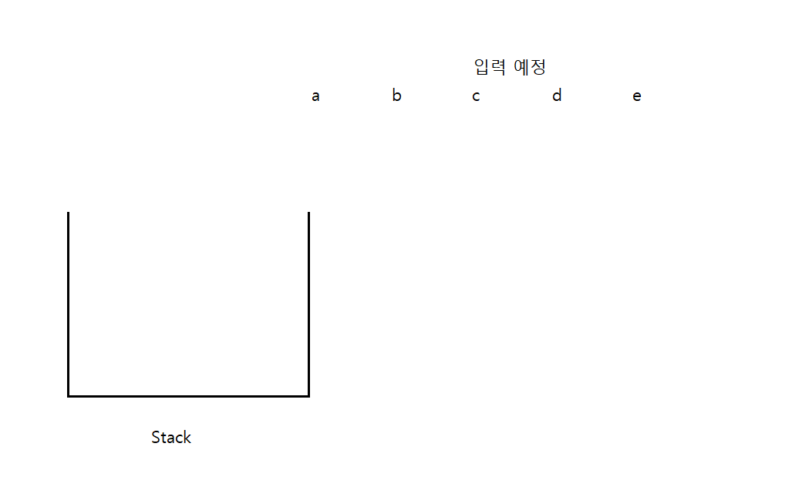

# 1.  Stack 이란? 
## 가장 나중에 들어온 데이터가 가장 먼저 나가는 방식(Last In First Out)의 자료 구조. 
### 즉 하나의 통에 데이터가 아래의 그림과 같은 구조로 쌓이고 맨 위의 데이터 부터 빠져 나간다. 


### 위와 같이 비어있는 스택과 입력 예정의 데이터가 있다 가정하자. 입력예정의 0번 idx 데이터를 넣으면


### 이렇게 스택에 a가 들어오게(push) 된다. 이 때 한번 더 push를 하게 되면? 

### 위와 같이 a 위에 b가 push 된 것을 볼 수 있다. 

### 이 상태에서, 스택을 꺼내 (pop) 면 가장 위에 있는 b가 먼저 빠저 나가게 될 것이다. 


## 스택 예시 문제 
### [올바른 괄호](https://school.programmers.co.kr/learn/courses/30/lessons/12909)

`위 문제는 String s = "()()";, "(())()"; ")()(" 형태의 문자로 들어오게 된다
그러면 파라미터로 들어온 s 값을 순번 대로 쪼개서 () 느낌으로 만들어지는지 판단을 하고
Stack에서 pop 해 나가며 나중에 Stack이 비어있는지 아닌지 판단 하면 되는 문제이다. 
`
<br>

```
Stack<Charecter> stk = new Stack<>(); // 스택 선언 
char[] cArr = s.toCharArray(); // 문자열 타입(String)인 s를 글자 단위(charecter)로 쪼개서 배열화.

//  문자열 길이만큼 반복 
for(char c : cArr) {
    if(cArr.isEmpty() || cArr.peek() != '(') stk.push(c); 
    else if(stk.peek() == '(' && c == ')) stk.pop(); // 이 구문은 아래 설명 참조 
}

|        |
|        |
|        |
|        |
|        |
|        |
 --------

이러한 스택이 있다면 cArr = {'(',')','(',')'}; 로 되어 있음. 

|        |
|        |
|        |
|        |
|        |
|   (    |  <== 스택이 비어 있었으니, cArr[0]가 push 됨. 
 --------

     )      <== 다음에 들어올 c

|        |
|        |
|        |
|        |
|        |
|   (    |  <== 스택의 peek() 값이 (임 
 --------

즉 if(stk.peek() == '(' && c == '))  조건에 만족되니 스택을 pop(); 

|        |
|        |
|        |
|        |
|        |
|        |  <== 스택의 pop() 
 --------

스택이 또 비어 있으니 다음 c값 push 

|        |
|        |
|        |
|        |
|        |
|   (    |  <== 스택이 비어 있었으니, cArr[2]가 push 됨 
 --------
     )      <== 다음에 들어올 c

|        |
|        |
|        |
|        |
|        |
|   (    |  <== 스택의 peek() 값이 (임 
 --------

즉 if(stk.peek() == '(' && c == '))  조건에 만족되니 스택을 pop(); 

|        |
|        |
|        |
|        |
|        |
|        |  <== 스택의 pop() 
 --------
 
 모든 공정이 다 돌았을 때, 스택이 비어 있으므로 0을 정답으로 반환
```

### [같은 숫자는 싫어](https://school.programmers.co.kr/learn/courses/30/lessons/12906?language=java)

```
이 문제는 파라미터로 arr라는 배열이 주어진다. 

case 1 
  arr = {1,1,3,3,0,1,1}
  
case 2
  arr = {4,4,4,3,3}


이럴 경우에도 Stack을 써야하는 이유 :
스택이 비어 있지 않다면, 스택의 peek()값과 arr[i]가 동일하지 않은 값을 스택에 push 하는 방식으로 
풀이가 가능하기 때문이다.  아래 그림은 case 1을 기준으로 진행한 풀이 방식이다. 

|        |
|        |
|        |
|        |
|        |
|   1    |  <== 초기 스택이 비어 있으니 arr[0]을 push   
 --------
 
|        |
|        |
|        |
|        |
|        |
|   1    |  <== 스택의 peek()와 arr[1]값이 동일하니 push 진행하지 않음.  
 --------

|        |
|        |
|        |
|        |
|   3    |  <== 스택의 peek()와 arr[2]값이 동일하지 않기 떄문에 push .
|   1    |  
 --------
 
|        |
|        |
|        |
|        |
|   3    |  <== 스택의 peek()와 arr[3]값이 동일하기 떄문에 push 진행 X .
|   1    |  
 --------
 
|        |
|        |
|        |
|   0    |  <== 스택의 peek()와 arr[4]값이 동일하지 않기 떄문에 push .
|   3    |
|   1    |  
 --------
 
|        |
|        |
|   1    |  <== 스택의 peek()와 arr[5]값이 동일하지 않기 떄문에 push .
|   0    |
|   3    |
|   1    |  
 --------

|        |
|        |
|   1    |  <== 스택의 peek()와 arr[5]값이 동일하기 떄문에 push 진행 X.
|   0    |
|   3    |
|   1    |  
 --------


그렇기 때문에 Stack 방식으로 풀이가 가능하다. 
```

# 2.  Queue란? 
## 가장 먼저 들어온 데이터가 가장 먼저 나가는 방식(First In First Out)의 자료 구조.
### 앞 뒤가 뚤려있는 원통 형태의 자료 구조라 생각하면 편하다 

```
        -----------------
        
                                    입출력 데이터 (a,b,c)
        
        -----------------

        -----------------
        
              abc                   
        
        -----------------

        -----------------
        
abc                             
        
        -----------------

이런 식으로 들어온 순서 대로 나가는 자료 구조를 Queue(큐) 라고 함 

```

## 큐 예시 문제
